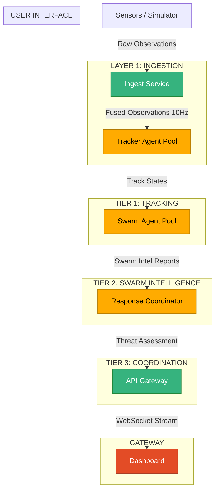
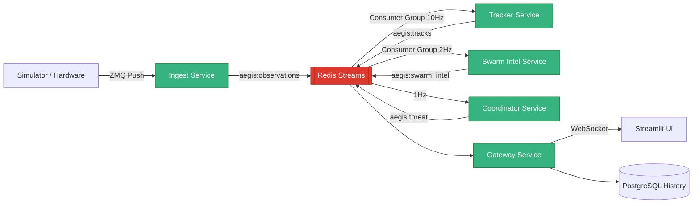
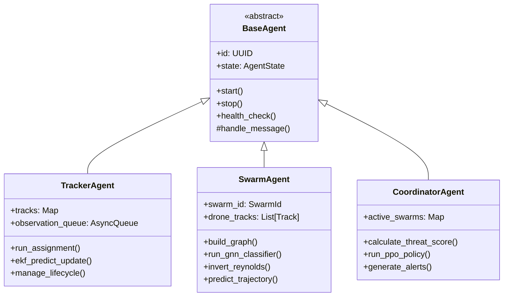

# AEGIS-AI: Multi-Agent Swarm Intelligence Tracking System

> The optimal counter to a swarm is another swarm.

AEGIS-AI is a distributed multi-agent system for real-time detection, tracking, and behavior analysis of hostile drone swarms. This system uses a society of cooperative AI agents that mirror the structure of the threat, providing scalable, resilient situational awareness.

---

## Core Algorithms

| Component | Algorithm | Purpose | Performance |
|-----------|-----------|---------|-------------|
| Data Association | Hungarian Algorithm (LAPJV) | Assign observations to tracks | O(N²), 10Hz for N=200 |
| State Estimation | Extended Kalman Filter (CTRA Model) | Drone position/velocity tracking | 7-dimensional state vector |
| Swarm Grouping | Modified DBSCAN | Cluster drones into swarms | Spatial + Velocity distance metric |
| Graph Construction | Dynamic Interaction Graph | Represent swarm topology | Nodes: drones, Edges: interaction links |
| Behavior Classification | Graph Attention Network (GAT) | Classify swarm behavior | 3 layers, 4 heads, 6 behavior classes |
| Parameter Inversion | Maximum Likelihood Estimation | Extract Reynolds flocking weights | Solve linear system for [w_sep, w_align, w_coh] |
| Threat Scoring | Weighted Composite Score | Rank swarm threat level | 0.0 → 1.0 normalized score |
| Response Allocation | Proximal Policy Optimization (PPO) | Optimal countermeasure assignment | Trained in simulation |

---

## Example Scenarios

| Scenario | Description | Drones |
|----------|-------------|--------|
| `saturation_attack` | Massed frontal assault with high speed | 50-200 |
| `decoy_strike` | Decoy swarm diverting attention from main attack | 40 |
| `dispersed_formation` | Wide spread low coherence swarm | 30 |
| `loitering_munitions` | Stationary loitering pattern | 25 |
| `split_merge` | Dynamic splitting and merging maneuvers | 60 |

---

## High Level Architecture Layers



---

## System Characteristics

| Property | Value |
|----------|-------|
| Maximum tracked drones | > 1000 |
| Maximum concurrent swarms | 20 |
| Tracking latency | < 100ms |
| End-to-end latency | < 500ms |
| Update rate (tracks) | 10 Hz |
| Update rate (swarm intel) | 2 Hz |
| Update rate (threat assessment) | 1 Hz |
| UI refresh rate | 2 Hz |
| Availability target | 99.99% |

---

## Architecture Principles

✅ **No Single Point of Failure** - Every critical function runs as a pool of distributed agents 

✅ **Horizontally Scalable** - Agent pools automatically scale with threat size 

✅ **Zero Centralized Bottlenecks** - No single process handling all data 

✅ **Computation Follows Threat** - Agents are spawned and terminated dynamically 

✅ **Resilient To Degradation** - System continues operating during partial failure 

✅ **Math-Driven Design** - Code structure maps 1:1 to mathematical architecture 


---


## Repository Structure

```
├── core/                     # Core domain logic & algorithms
│   ├── agents/              # Base agent implementations
│   │   ├── base_agent.py    # Abstract agent interface
│   │   ├── coordinator.py   # Response coordinator agent
│   │   ├── swarm_agent.py   # Swarm intelligence agent
│   │   └── tracker_agent.py # Individual drone tracking agent
│   ├── swarm/               # Swarm analysis algorithms
│   │   ├── behavior.py      # Behavior classification
│   │   ├── graph.py         # Graph construction & GNN
│   │   └── reynolds.py      # Reynolds parameter inversion
│   ├── tracking/            # Tracking algorithms
│   │   ├── ekf.py           # Extended Kalman Filter
│   │   ├── fusion.py        # Sensor fusion
│   │   ├── hungarian.py     # LAPJV data association
│   │   └── track.py         # Track lifecycle management
│   └── simulation/          # Drone swarm simulator
│
├── services/                 # Microservice deployments
│   ├── ingest/              # Sensor data ingestion & fusion
│   ├── tracker/             # Distributed tracking worker pool
│   ├── swarm_intel/         # Swarm analysis service
│   ├── coordinator/         # Threat assessment & response
│   └── gateway/             # API Gateway / WebSocket server
│
├── ui/                       # Streamlit monitoring dashboard
│   ├── pages/
│   │   ├── 01_live_ops.py   # Live operations radar map
│   │   ├── 02_swarm_graph.py# Swarm topology visualization
│   │   ├── 03_behavior.py   # Behavior analysis
│   │   ├── 04_scenarios.py  # Simulation scenario launcher
│   │   └── 05_analytics.py  # System performance metrics
│   └── app.py
│
├── infra/                    # Infrastructure as Code
│   ├── docker/              # Container definitions
│   ├── k8s/                 # Kubernetes manifests
│   └── terraform/           # Cloud infrastructure
│
├── tests/                    # Test suite
│   ├── unit/
│   ├── integration/
│   └── scenarios/           # Threat scenario tests
│
└── System_Design/            # Complete system documentation
```

---

## System Architecture

### Complete Data Flow Pipeline



---

### Agent Hierarchy



---

### Module Dependency Graph

```mermaid
flowchart BT
    classDef core fill:#165DFF,color:white
    classDef services fill:#36B37E,color:white
    classDef ui fill:#E34C26,color:white

    Constants[core/constants]:::core
    Agents[core/agents]:::core
    Tracking[core/tracking]:::core
    Swarm[core/swarm]:::core
    Simulation[core/simulation]:::core

    SvcTracker[services/tracker]:::services
    SvcSwarm[services/swarm_intel]:::services
    SvcCoordinator[services/coordinator]:::services
    SvcGateway[services/gateway]:::services
    SvcIngest[services/ingest]:::services

    UI[ui/]:::ui

    Constants --> Agents
    Constants --> Tracking
    Constants --> Swarm
    Constants --> Simulation

    Agents --> Tracking
    Agents --> Swarm
    Agents --> Simulation

    Tracking --> SvcTracker
    Swarm --> SvcSwarm
    Simulation --> SvcIngest

    SvcTracker --> SvcCoordinator
    SvcSwarm --> SvcCoordinator

    SvcCoordinator --> SvcGateway
    SvcGateway --> UI

    note over UI: UI never imports services directly
    note over UI: Only communicates via WebSocket/REST
```

---

## Quick Start

### Prerequisites
- Python 3.11+
- Redis 7.0+
- Docker (optional)

### Local Development
```bash
# Install dependencies
pip install -e .

# Start Redis
redis-server --daemonize yes

# Run all services
make run-all

# Open UI
open http://localhost:8501
```

### Run Simulation Scenario
```bash
# Launch saturation attack scenario
python -m core.simulation.swarm_sim --scenario saturation_attack --drones 50
```

### Run Tests
```bash
# Unit tests
pytest tests/unit/ -v

# Scenario tests
pytest tests/scenarios/ -v
```

---

## Additional Documentation

Complete system documentation is available in the `System_Design/` directory:
- [ARCHITECTURE.md](System_Design/ARCHITECTURE.md) - Full technical architecture
- [API.md](System_Design/API.md) - REST / WebSocket API specification
- [SIMULATION.md](System_Design/SIMULATION.md) - Swarm simulator design
- [TESTING.md](System_Design/TESTING.md) - Testing strategy & results
- [INFRASTRUCTURE.md](System_Design/INFRASTRUCTURE.md) - Deployment architecture
- [DECISIONS.md](System_Design/DECISIONS.md) - Architectural decision records

---

